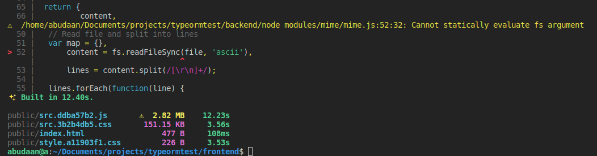
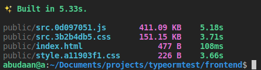

# Energy Label app

This is a simple SPA where you can retrieve address details such as street, city and area, and the energy-label of an address by entering a postal code, a house-number and optionally a house-number addition. It uses 2 different rest apis:

- address data: <https://www.postcodeapi.nu/docs/>
- energy label data: <https://www.energielabel.nl/>

## Install and run the SPA

The project runs both the backend and the frontend in a Docker container:

```
docker-compose run --no-deps frontend npm ci
docker-compose run --no-deps backend npm ci
docker-compose up
```
Add `energylabel.test 127.0.0.1` to your `/etc/hosts` file and you can access the SPA on <https://energylabel.test/>.
The swagger documentation can be found at: <https://energylabel.test/docs>.

## Objective

This project's aim is to show you how you can use the same backend TypeORM entities in the frontend without having to load the complete TypeORM library. Note that TypeORM doesn't run in the frontend anyway because of its Node dependencies such as `fs` and database controllers.

The solution is actually quite simple: the TypeORM library contains shims that you can use on the frontend. These shims contain all decorator functions that are available in TypeORM, only they don't actually do anything, they are just stub functions. The models in this app also use decorators from Ts.ED so I created a shim for all used Ts.ED decorators as well.

In your package.json file you add the path to these shims to the browser key; this instructs Parcel to use the shim files instead of looking for the modules in the `node_modules` folder when it encounters an import from TypeORM or Ts.ED, e.g. `import { Entity } from 'typeorm'`:

```
  "browser": {
    "typeorm": "./shim/typeorm.js",
    "@tsed/common": "./shim/tsed.js"
  },
```

## Compiling using frontend entities

In the file [store.ts](./frontend/src/store.ts) you can see that for the initial state a [Label](./backend/src/entities/Label.ts) entity and a [Address](./backend/src/entities/Address.ts) entity get instantiated. At the top of the file the entity files are imported from the backend folder, so the backend and the frontend will always use the same entities.

If I were to compile this **without** the additional browser key in package.json as described above, the frontend will be compiled but with a lot of warnings. It doesn't run in a browser because of the missing dependencies though.

Here is (a part of) the console output:



Note that Parcel complains about missing `fs` and the filesize of the resulting bundle: 2.82 MB

Now this is console output when we do use the shims:



The filesize is only a little over 411 KB! So no TypeORM and Ts.ED modules are included. And this version actually runs in a browser because when for instance the `@Entity` decorator gets called upon instantiation of an entity, it just runs an empty function in the shim. Just for fun I have added a console.log statement that prints out the type of entity that is being instantiated; check your browser log.

## Conclusion

Using the same TypeORM entities both in the backend and the frontend is very easy. The solution provided by TypeORM also serves as an example to 'outsmart' other backend decorator functions on the frontend, like controller decorators from Ts.ED.

## More reading

- <https://github.com/typeorm/typeorm/issues/2841>
- <https://github.com/typeorm/typeorm/issues/62>


